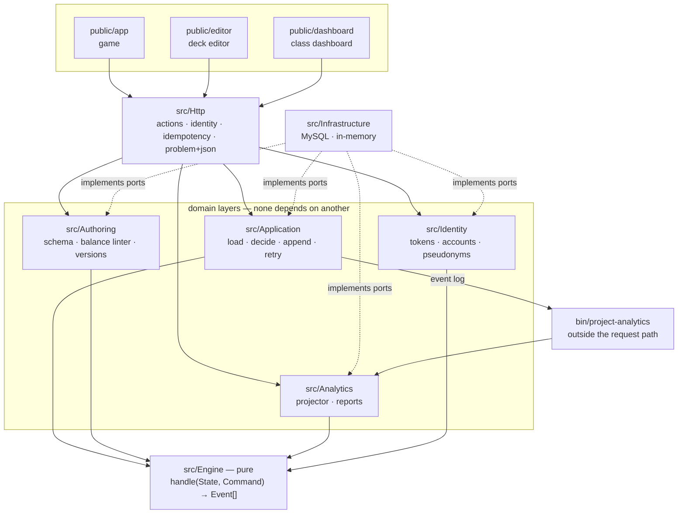

# MathDeck

Server-authoritative rules engine for a turn-based educational mathematics card
game. Players hold operand and operator cards and lay out an expression that hits
the target on the board.

Built so far: **phase 2 (engine core)**, **phase 3 (persistence and replay)**,
Server-authoritative rules engine, event store, REST API, browser client, deck
editor and teacher dashboard for a turn-based educational mathematics card game.
Phases 2 through 8 are built; see [Scope](#scope).

```bash
make up        # bring everything up
make seed-demo # local accounts: miss-lee / teach-me-1234, ada / play-1234

          # http://localhost:8080/app/       — play it
          # http://localhost:8080/editor/    — author a deck
          # http://localhost:8080/dashboard/ — see how a class is doing
```

Open it twice, create a match in one tab and join the same match id as the opponent
in the other, to play both sides.

## The one idea

```
handle(State, Command) -> Event[]
State = fold(Event[])
```

`MathDeck\Engine\Engine::handle()` is a pure function. It performs no I/O, reads no
clock but the injected one, and uses no randomness at all — the shuffle was decided
by the match seed at creation. Four things fall out of that single decision:

| Property | Why it follows |
|---|---|
| **Server authority** | Commands carry intent (`PlayCards{cardIds}`), never state. There is no score, result or board contents for the server to take on trust. |
| **Determinism** | Same seed plus same command sequence reproduces a match exactly, on any machine, at any later date. |
| **Telemetry** | The event log *is* the analytics source. Gameplay is not instrumented separately; phase 7 projects this same stream. |
| **Testability** | A function with no I/O is a table test. 285 tests run in ~50s. |

The invariant is enforced, not just asserted in prose — see
`tests/Unit/Engine/ReplayDeterminismTest.php`. If it fails, event sourcing here is
decorative: snapshots cannot be rebuilt and the reports describe a game that never
happened.

`src/Engine` depends on nothing outside itself, and `deptrac` fails the build if
that ever stops being true.



Arrows point the way dependencies point. Nothing points *into* the engine but the
domains above it, and nothing points out of it at all.

## Engine (phase 2)

**Exact arithmetic, never floats.** `Math\Rational` keeps values as integer
fractions in lowest terms. Three- and five-card expressions happen to survive double
arithmetic with this operand pool, but **261 of the 874,577 seven-card expressions
do not**: `1 ÷ 3 × 7 × 3` is exactly 7 and evaluates to `6.999999999999999`, so a
child who answered correctly is told they are wrong. Letting teachers widen the
operand pool in phase 6 only enlarges that set. Integer overflow raises rather than
silently promoting to float.

**Reject reasons are pedagogy, not validation.** `Rule\RejectReason` is the
vocabulary the teacher dashboard will speak. `OFF_BY_ONE` and
`OPERATOR_PRECEDENCE_IGNORED` are the two that make the error-distribution report
worth looking at: the second fires when the player's answer matches a strict
left-to-right reading but not the correct one. It is guarded by
`Expression::precedenceIsSignificant()`, so `2 * 3 + 4` — where both readings agree
— is never misfiled as a precedence error.

**Protocol faults and learner mistakes are different things.** A `Violation` is
either `Severity::Protocol` (wrong turn, cards not held, finished match — a correct
client cannot send this, so it throws `IllegalCommand` and produces no event) or
`Severity::Gameplay` (a plausible thing to try — recorded, costs the turn). Mixing
them would let tampering pollute the error clusters.

**A rejected attempt costs the turn, not the cards.** The same hand can be tried
again next time round.

**Latency is measured server-side** from the moment the turn opened. A
client-reported duration would be both forgeable and, on a school laptop, wrong.

**The engine folds its own events as it emits them** (`EventStream`). How many cards
to draw depends on the hand *after* the played cards left it, so the engine reads
its own reducer rather than duplicating the logic — the two cannot drift apart.

## Persistence (phase 3)

**No game state is stored anywhere.** Because `MatchState::start()` is deterministic,
a match is fully described by its seed record plus its event log. There is no
serialised `MatchState`, and therefore no state schema to version, migrate, or get
subtly wrong. Snapshots remain available as a pure optimisation for when replay gets
slow; they are a cache over this, and can be dropped and rebuilt at will.

Three tables (`migrations/001_init.sql`):

| Table | Holds |
|---|---|
| `matches` | the opening position: `deck_version_id`, `seed`, `player_ids`, and a **copy** of the deck's rules |
| `match_events` | the log, `PRIMARY KEY (match_id, seq)` |
| `match_commands` | `PRIMARY KEY (match_id, client_command_id)` plus the seq range it produced |

**The primary key on `(match_id, seq)` is the concurrency control.** Two writers
racing for the same sequence number: one inserts, the other gets a duplicate-key
error, reloads and decides again. `MatchService` retries three times and then gives
up rather than forcing a write. No locks, and correct even when a cache has evicted
everything.

**Idempotency is a table, not a convention.** `match_commands` is written in the
same transaction as the events it produced. A retried request over flaky school wifi
returns the original events instead of playing the cards twice. The command row is
inserted *first* on purpose: both inserts can fail with the same duplicate-key
SQLSTATE, and ordering the writes means only one constraint can be in play at a
time, so the failure is unambiguous without parsing driver messages.

**Deck rules are copied into the match, not referenced.** Editing a deck must never
change how a finished match replays.

**Event payloads are a contract.** The forward direction lives on each event
(`type()`, `payload()`), the reverse on the same class (`fromPayload()`), so a
payload's shape is defined in exactly one file. `EventSerializer` is only the
registry connecting a stored type string to a class — and an unknown type throws
rather than being skipped, because a partial fold is a wrong match state that looks
like a right one. A test walks `src/Engine/Event` on disk and fails if any event
class is missing from the registry.

## API (phase 4)

| | |
|---|---|
| `POST /v1/matches` | create a match |
| `GET /v1/matches/{id}` | the match as the calling player sees it |
| `POST /v1/matches/{id}/commands` | play cards or forfeit |
| `GET /v1/matches/{id}/events?since=N` | the log from a cursor |

**A wrong answer is a 200.** A learner who plays `3 + 4` against a target of 12 made
a perfectly good request; the rejection is an event, not a status code. Only requests
a correct client could not have sent — wrong turn, cards not held, finished match —
return 4xx, as `application/problem+json` with a machine-readable `reason`.

**The player id comes from the token, never the body.** `PlayCardsRequest` has no
`playerId` field at all: what is not parsed cannot be trusted by accident.

**The seed is never accepted from a client.** A client that picks the seed knows the
deck order before a card is dealt. There is a test that posts one anyway and asserts
the deal is unchanged.

**Two projections, not one.** `MatchView` hides opponents' hands, the draw pile and
the seed. `EventView` hides the same things in the log — and that second one is
easy to forget: project state carefully, then stream raw events, and `cards_drawn`
hands the opponent's draw (and the pile's order) straight back. Visibility is an
exhaustive `match` with no permissive default, so a new event type cannot reach a
client before somebody has decided whether it is public.

The leak tests encode the response and grep it for values that must not be
reachable, rather than asserting a key is absent — key-name assertions keep passing
while a nested field leaks. They run at both the unit and the HTTP level.

**`Idempotency-Key` is required on commands** and maps onto the `clientCommandId`
phase 3 already stored. A retry returns the original events and sets
`Idempotency-Replayed: true`. It is scoped to the commands route: match creation is
*not* idempotent yet, and demanding the header there would promise a guarantee
nothing honours.

**openapi.yaml is enforced, not decorative.** Every functional test validates its
request and response against the spec through `league/openapi-psr7-validator`, so the
two cannot drift without a test going red. `postman_collection.json` is generated
from the same file (`make postman`) rather than hand-maintained.

## Browser client (phase 5)

Plain ES modules and a real Tailwind build. No framework, no bundler, no CDN at
runtime: `public/app/app.css` is generated by `make css` and committed, so the page
has no third-party dependency once served.

**The client renders what the server sent.** It never computes score, turn order, or
whether a play was accepted — those arrive as `MatchView` and events. The one thing
worked out locally is the preview under the tray, and it is labelled *"preview; the
server decides"* in the interface itself.

**The preview needs exact arithmetic too.** `rational.js` mirrors the engine, for the
same reason: a preview that disagrees with the server is worse than no preview,
because the learner is told they are right and then told they are wrong.

**Reason codes become sentences.** `OPERATOR_PRECEDENCE_IGNORED` renders as
*"Remember that × and ÷ happen before + and −."* This is where the decision to make
the taxonomy pedagogical rather than merely diagnostic pays off — the same codes
drive the match log, the inline hint, and the phase 7 dashboard.

**Retries reuse their idempotency key.** `MatchApi` generates one key per intent and
keeps it across a transport-failure retry, since the first attempt may well have
reached the server. A 4xx is an answer, not a failure, and is never retried.

**Polling uses the `since` cursor**, which is why the events endpoint exists. The
client holds a cursor, asks for what it has not seen, and refreshes state only when
something actually arrived.

`tests/js/` runs under `node --test` with no test framework installed — the modules
are plain ESM, so Node can load them directly (`public/app/js/package.json` marks the
directory as ESM; browsers ignore it).

## Deck authoring (phase 6)

A deck is data. Nothing a teacher writes needs a deployment, which is the whole
point of the format: operands, operators, targets and a few knobs is the entire
vocabulary, and `schema/deck-v1.schema.json` is its definition.

**Schema validity is not playability.** A deck can be perfectly well-formed and
still contain a target nobody can reach — and nobody finds out until a classroom
cannot solve it. So publishing runs a balance check, and an unreachable target is an
error, not a warning.

**How the check works.** Expressions here are flat and unparenthesised, so with
precedence every one of them is a sum and difference of *terms*, a term being a
chain of × and ÷:

```
term(1) = the operand pool
term(k) = term(k-1) ∘ operand,   ∘ ∈ {×, ÷}
expr(k) = term(k) ∪ ⋃ⱼ { expr(k-j) ± term(j) }
```

Both chains are left-associative, exactly as the engine evaluates them. Fractions
are kept exactly and never dropped for being non-integer — `1 ÷ 3 × 7 × 3` reaches 7
through values that are not integers on the way.

**`reachable` is three-valued, on purpose.** A very large operand pool can exhaust
the search budget, and a deck must never be refused on the strength of a search that
gave up. Unknown is a warning; only a completed search that found nothing is an
error.

**The linter is checked against the engine.** Every example it offers is parsed by
`Engine\Math\Expression` and asserted to evaluate to the target. Two independent
implementations of the same rules, and a test that stops them drifting.

**Published means frozen.** Matches record the version they were played with, so
editing a published deck would rewrite the meaning of results already collected —
silently. Edits fork a new draft at the next version number, and a draft cannot
start a match.

**The editor lints on the server.** It debounces and calls `POST /v1/decks/lint`
rather than re-implementing the rules in JavaScript: a second implementation would
eventually disagree with the one that decides. Field limits come from
`GET /v1/deck-schema`, the same file the server validates against.

**The editor does not re-render while you type.** Unlike the game, replacing a form
under a cursor loses focus and half-typed input, so the shell is drawn when the deck
changes and only the lint panel updates on input.

*Known limitation:* the linter proves a target is reachable from the **deck**, not
from every **hand**. A hand that cannot reach its target is a normal part of play —
you pass the turn — but per-hand solvability is a different and much stronger
property, and this does not check it.

## Analytics (phase 7)

**The event log is the telemetry.** Gameplay is not instrumented separately —
`fact_attempt` is a projection of the same stream the engine already emitted, which
is why every number a teacher sees is, by construction, a thing that actually
happened in a match.

**Reports never read the event log.** Aggregating over `match_events` at query time
works at a hundred matches and collapses at a hundred thousand. A worker projects
eagerly; reports read only the projection. There is a functional test asserting
reports are empty until the worker has run, because that is the correct answer
rather than a bug.

**Re-projection is idempotent.** Facts are keyed by `(match_id, seq)` and the cursor
lives in `projection_cursors`. A worker you cannot safely restart is a worker nobody
dares restart.

**Half an attempt is not a fact.** An attempt is two events — `cards_played` with the
expression and server-measured latency, then its outcome. If a batch stops between
them the cursor stays behind the dangling play, so the next run sees both.

**One definition of "median", two implementations.** The reports are aggregated in
PHP for tests and in SQL in production, and a median that differed by one row
between them would be invisible and would quietly give a teacher a different picture
depending on which path answered. `Analytics\Percentile` pins it as the lower
median, and a **shared contract test runs both implementations against identical
expectations**.

**The error clusters are clean by construction.** Only misconception codes reach the
log as events — protocol faults (wrong turn, cards not held) throw and produce
nothing — so a broken or dishonest client cannot show up in a teacher's report as a
learning difficulty. That decision was made in phase 2 for this report.

**Latency is split by outcome, never averaged.** Slow-and-right and fast-and-wrong
are different problems and want different teaching.

### The dashboard

Form follows the job. "Where they go wrong" is a magnitude ranking across long-named
categories, so it is a **horizontal bar in a single hue** — the reason codes are
quantities to rank, not series to tell apart, and a categorical palette would imply
a distinction that is not in the data. "How long an attempt takes" is a range per
outcome, so it is a **dumbbell**: median and 90th percentile as two dots. Per-learner
figures are a **table**, because several measures per identity is what tables are
for. The headline is one hero figure, not a chart.

Colours are the validated reference palette (blue 450/250 light, 400/550 dark),
checked with the palette validator in ordinal mode for both modes. Marks carry
colour; text always wears ink tokens. Charts are drawn at the container's real pixel
width rather than scaled into it — a squeezed viewBox shrinks the type with it.

All three surfaces follow the operating system's light/dark setting. The dashboard
drives its chart marks from CSS custom properties, because an SVG fill needs a named
role; the game and editor use Tailwind's `dark:` variants, because ordinary chrome
does not. Both respond to the same `prefers-color-scheme` signal, and `color-scheme:
light dark` is declared so the browser themes native controls — selects, date
pickers, checkboxes, scrollbars — which no utility class can reach.

## Hardening (phase 8)

**Authentication is real now.** Phases 4 through 7 shipped with the bearer token
being the player id verbatim — anyone could be anyone by typing a name. The
*boundary* was the work; this is the check that finally sits behind it, and not one
endpoint had to change to gain it. Tokens are HMAC-signed, expiring, and carry the
role as a signed claim, so a student cannot become a teacher by editing anything
they hold. There is a test that sends `Bearer alice` — exactly what worked for four
phases — and asserts a 401.

**Sign-in is throttled.** Classroom passcodes are short and memorable by design —
`play-1234` falls to a few thousand guesses — so a throttle is what makes that
choice defensible rather than negligent. Two buckets, and a breach of either
answers `429` with a `Retry-After`: per account, which stops someone grinding at
one child's passcode, and per client address, which stops the same attacker
spraying one guess across every account instead. A success clears the account's
bucket but deliberately not the address's, so guessing one account correctly does
not refund the budget being spent against all the others.

The address comes from the **last** `X-Forwarded-For` hop, the one Nginx itself
appended — the leftmost entry is whatever the client chose to send, and trusting it
would let an attacker mint a fresh bucket per guess.

**Match creation is idempotent.** Commands have carried an idempotency key since
phase 4; creation was the one write that did not, and it is the request most likely
to be retried — a child taps "new match", sees nothing, and taps again. Same
mechanism as the event store: a unique index on `matches.creation_key`, and the
loser of the race reads back what the winner wrote.

**Sign-in failures are indistinguishable.** "No such account" and "wrong passcode"
return the same 401 with the same wording, and the authenticator verifies against a
decoy hash when no account exists so the two paths take similar time. Otherwise the
endpoint is a way to discover which children have accounts.

**Analytics stores pseudonyms, not names.** `fact_attempt` is keyed by a random
`analytics_key`, resolved at the projection boundary; the mapping back lives in the
identity store behind the teacher check, and only the progression report crosses
back. Dropping the `analytics_key` column would leave the aggregate picture intact
and the individuals unidentifiable.

That change is also the clearest demonstration of why phase 3 was built the way it
was: migration 005 **deletes every fact and resets the cursor**, and the worker
rebuilds them all correctly pseudonymised from the event log. In a system that
stored its state directly, this would have been an irreversible data migration.

**Mutation testing, scoped where it pays.** On a rules engine, line coverage can
read 100% while a flipped `>=` goes unnoticed. `make mutation` runs Infection over
the arithmetic, the rules and the analytics; CI gates on it. It went 76% → 90% MSI
during this phase, and what it found is below.

**The rest:** security headers on every response and on the static pages, a
production image with the source baked in and opcache locked (`docker/prod.Dockerfile`),
a coverage gate at 85%, and CI running static analysis, both test suites against a
real MySQL, the browser-client tests and mutation testing.

### What mutation testing found

Not just untested branches — a piece of code that was **wrong**. `RejectReason::isMisconception()`
declared which codes "belong in the teacher-facing error clusters". It was never
called, and it excluded `MALFORMED`, which does appear in them. A second, unenforced,
incorrect copy of a rule the system enforces elsewhere (through `Severity`, which
makes protocol faults throw before they can ever become events). Deleted.

It also demanded real tests for `Percentile`, `ReportFilter`'s inclusive date
bounds, `ProjectionRunner`, `Attempt::toArray`, and `Rational::equalsInt` — the
comparison the entire game turns on, which had no test distinguishing `3/2` from
`3`.

## Layout

```
src/Engine/          pure. no I/O, no framework, no dependencies
  Engine.php           handle(State, Command): Event[]
  EventStream.php      accumulates events while folding them into state
  Math/                Rational, Expression (with and without precedence)
  Card/ Command/ Event/ Rule/ State/ Random/ Exception/

src/Identity/        accounts, password hashing, signed tokens, pseudonyms

src/Analytics/       the read side: projector, facts, report contracts
  AttemptProjector.php pairs plays with outcomes into facts
  Percentile.php       one definition of median, shared by both implementations
  Port/                AttemptStore, ReportQueries, ProjectionCursors, TeacherDirectory

src/Authoring/       deck authoring: schema, balance linter, versioning
  DeckService.php      create, update, publish, fork
  Lint/                SchemaValidator, BalanceLinter, DeckLinter
  Port/                DeckStore, DeckIdFactory

src/Application/     the first code allowed to know storage exists
  MatchService.php     load, decide, append, retry
  MatchRepository.php  rebuilds a match from seed + log
  EventSerializer.php  the type registry
  Port/                EventStore, MatchStore — interfaces owned by this layer

src/Infrastructure/  adapters
  InMemory/            reference implementation and test double in one
  Mysql/               PDO, transactions, duplicate-key classification
  Random/              the one place real randomness is used: minting seeds

src/Http/            Slim actions and middleware
  Action/              four endpoints, each one thin
  Middleware/          identity, idempotency, RFC 7807 error mapping

config/container.php the composition root, deliberately outside src/
public/index.php     the API front controller
public/app/          the browser client: index.html, app.css, js/
public/editor/       the deck editor
public/dashboard/    the teacher dashboard
bin/migrate          applies migrations/*.sql, once each
bin/project-analytics the projection worker (--loop for the compose service)
bin/seed-demo        local accounts; refuses to run without an explicit opt-in
docker/prod.Dockerfile  production image: source baked in, no dev tooling
.github/workflows/ci.yml
schema/              deck-v1.schema.json — served at GET /v1/deck-schema
```

`src/Http` depends on ports, never on adapters. The concrete wiring lives in
`config/container.php`, which sits outside `src/` precisely because a composition
root is the one place allowed to know both sides — deptrac scans `src/`.

## Running it

No local PHP needed — everything runs in a container:

```bash
make install           # composer install
make check             # phpstan level 8 + deptrac + phpunit
make coverage          # line coverage for src/Engine and src/Application
make test-integration  # brings up MySQL, runs everything including the DB suite
make up                # serve the API on http://localhost:8080 (Nginx + PHP-FPM + MySQL)
make down              # tear it all down
make migrate           # apply pending migrations to a running database
make project           # run the projection worker once
make seed-demo         # local accounts with known passcodes
make mutation          # Infection over the engine, rules and analytics
make postman           # regenerate the collection from openapi.yaml
make test-js           # browser-client tests under node --test
make css               # rebuild the Tailwind stylesheet
```

Integration tests skip themselves when `MATCHDECK_DSN` is unset, so the default run
stays fast and dependency-free. When the variable *is* set and the database does not
answer, they fail rather than skip — a silently skipped integration suite is how CI
goes green without ever touching a database.

Current state: **310 PHP tests (2443 assertions) and 46 JavaScript tests**, 95.7%
line coverage, **91% mutation score** on the engine, rules and analytics; clean at
PHPStan level 8, zero deptrac violations.

Migrations are applied by `bin/migrate`, not by MySQL's init directory: init scripts
only run on a brand-new volume, so adding a migration used to mean destroying the
database to get it.

`composer.json` pins `config.platform.php` to 8.2.0. Dependencies here are installed
through the `composer:2` image, which runs a much newer PHP — without the pin,
Composer resolves for *that* interpreter and writes a lock file requiring a PHP this
project does not support. Everything passed locally and CI failed on its first run.

## Scope

Built:

- [x] Exact rational arithmetic
- [x] Expression parsing and evaluation with operator precedence
- [x] Misconception classification for wrong answers
- [x] Deterministic seeded deal and draw
- [x] The command handler, the event types and the reducer
- [x] Replay-determinism property tests
- [x] Event wire format with a registry completeness test
- [x] MySQL event store, optimistic concurrency, idempotent commands
- [x] Docker Compose environment and integration suite
- [x] Enforced layer boundaries
- [x] REST API with an enforced OpenAPI 3.0 contract
- [x] Per-player state and event projections, with leak tests at both levels
- [x] Idempotent commands over HTTP, RFC 7807 errors
- [x] Nginx + PHP-FPM + MySQL under Docker Compose
- [x] Browser client: play a match, live preview, per-player log, cursor polling
- [x] Deck editor: JSON Schema validation, live balance check, publish gate
- [x] Immutable published versions, forking, drafts barred from matches
- [x] Attempt projection, idempotent and cursor-driven, run by a worker
- [x] Teacher reports: progression, error clusters, latency by outcome
- [x] Dashboard with validated chart colours and a hover layer
- [x] Signed expiring tokens, hashed passcodes, role-gated class reports
- [x] Pseudonymous analytics keys, resolved only for a teacher
- [x] Mutation testing, coverage gate, CI, production image, security headers
- [x] Throttled sign-in, idempotent match creation
- [x] Dark mode across all three surfaces

Not here yet:

- Snapshots — deliberately deferred until replay is measurably slow
- Token revocation. Tokens are self-contained, so signing out is a client-side
  discard; a stolen token stays valid until it expires. Short lifetimes, not
  revocation, are the current answer.
- Account management: `bin/seed-demo` is the only way to create an account.
- Live updates are polled every 1.5s, not pushed; websockets or SSE would be the
  fix, and are not worth it until someone complains

## Two caveats on the current rules

Expressions are strictly alternating operand/operator with no parentheses, which
makes the card count necessarily odd — the original sketch said "2–5 cards", and 3–7
odd is what that actually means. Targets are drawn from the deck's target pool
without any solvability check; the balance linter that rejects unreachable targets
at publish time is phase 6 work.
